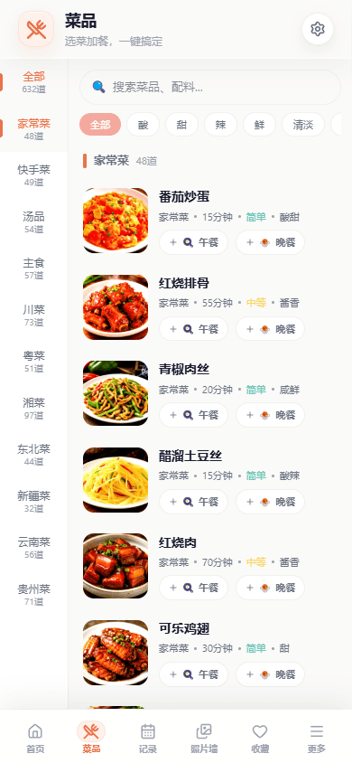
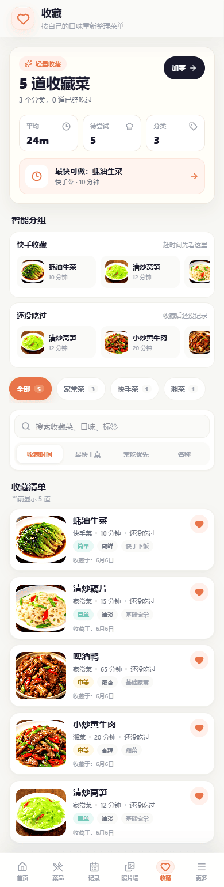
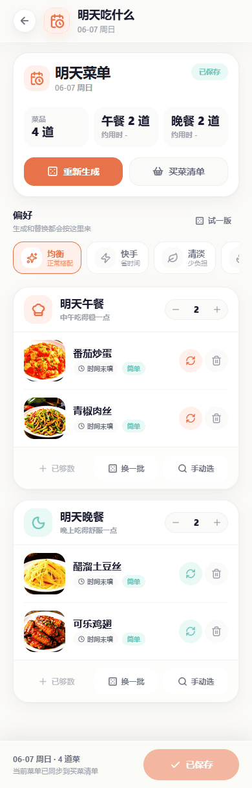
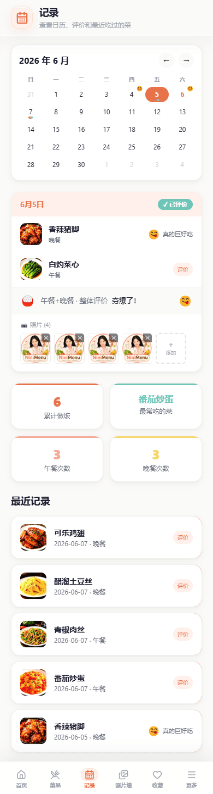
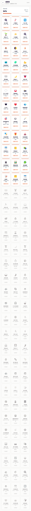
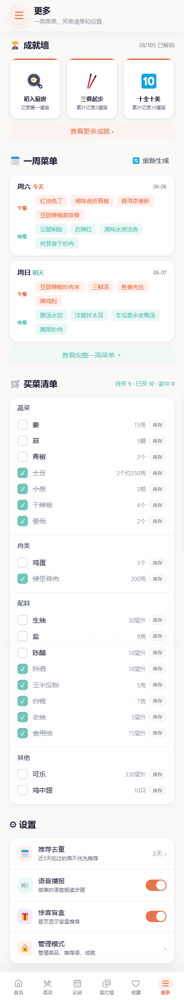
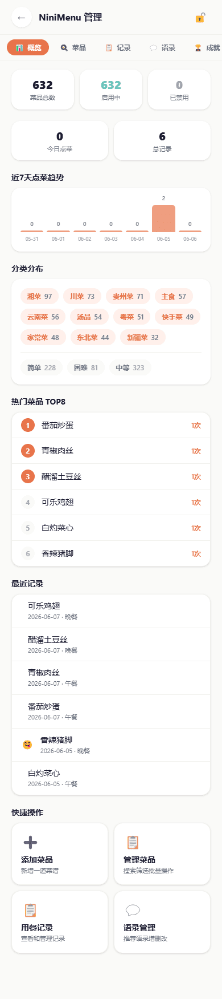

# NiniMenu

> 一款温馨的每日菜单推荐与食谱管理应用，告别"今天吃什么"的纠结。

NiniMenu 是一个前后端分离的全栈 Web 应用，旨在帮助用户轻松解决每日饮食决策问题。通过智能推荐、心情匹配、转盘抽奖、盲盒惊喜等多种趣味方式，让选菜变得有趣而不再纠结。同时提供完整的食谱管理、周计划生成、购物清单、成就系统等功能，打造一站式饮食管理体验。

## 应用截图

  
  
  
  

  
  
  
  

  

- **[使用说明](README_USER.md)** — 如何部署和使用 NiniMenu
- **[开发指南](README_DEV.md)** — 如何参与开发和构建
- **[更新日志](CHANGELOG.md)** — 版本更新记录

## 相关链接

* [Linux Do 社区](https://linux.do/)  

## 未来目标

### 功能完善

| # | 功能 | 当前状态 | 计划 |
|---|------|----------|------|
| 1 | 食谱营养信息 | 菜品无热量/营养数据 | 添加 calories/protein/fat/carbs 字段，支持每份营养估算 |
| 2 | 烹饪计时器 | 仅在烹饪模式可用 | 在菜品详情页步骤中也显示小型倒计时 |
| 3 | 购物清单 | 自动生成、分类、库存标记 | 支持分享购物清单（生成链接/图片）、历史清单对比避免重复购买 |
| 4 | 历史记录 | 日历视图 + 评分 | 添加统计报表：月度/年度吃饭趋势图、口味偏好饼图、烹饪时长分布 |
| 5 | 菜品搜索 | 仅名称搜索 | 支持按食材搜索（如"冰箱里有鸡蛋，能做什么"）、标签搜索 |
| 6 | 收藏夹 | 概览统计、智能分组、分类筛选、排序搜索 | 添加收藏自定义分组（如"减脂餐"、"周末大餐"） |
| 7 | 周计划 | 7天自动生成 | 支持拖拽调换日期、一键生成购物清单（跨多天合并）、分享周计划 |
| 8 | 盲盒 | 随机惊喜菜品 | 添加盲盒历史记录、每日限定主题盲盒 |
| 9 | 转盘 | 简单随机转盘 | 添加自定义转盘（限定分类/难度范围）、多人模式 |
| 10 | 管理后台 | 基础 CRUD | 添加数据导入导出（JSON/CSV）、操作日志、多管理员支持 |
| 11 | 成就系统 | 80+ 自动检测 | 添加成就分享图（生成精美卡片图片）、成就进度预告（下一个即将解锁的成就） |
| 12 | PWA | 基础 manifest | 添加 Service Worker 离线缓存、推送通知（提醒做饭/买菜） |

### 新功能规划

| # | 功能 | 描述 | 实用度 |
|---|------|------|--------|
| 1 | 冰箱库存 | 记录冰箱现有食材，推荐"清冰箱"菜谱（根据现有食材匹配菜品） | ⭐⭐⭐⭐⭐ |
| 2 | 健康报告 | 每周/月自动生成饮食健康报告：营养均衡度、重复率、新菜尝试率、烹饪活跃度 | ⭐⭐⭐⭐⭐ |
| 3 | 食材替换建议 | 某食材缺失时，推荐可替代食材及对应菜品变体 | ⭐⭐⭐⭐ |
| 4 | 多人家庭模式 | 多成员各自口味偏好，推荐时综合考虑（如一人不吃辣则降低辣菜权重） | ⭐⭐⭐⭐ |
| 5 | 厨艺进阶路线 | 根据已做菜品难度自动推荐"下一道挑战菜"，渐进式提升烹饪水平 | ⭐⭐⭐⭐ |
| 6 | 智能提醒 | 根据历史用餐时间，在饭点前 30 分钟推送"今天吃什么"提醒 | ⭐⭐⭐⭐ |
| 7 | 菜品对比 | 同一菜品不同次烹饪的评分/照片对比，看厨艺进步 | ⭐⭐⭐ |
| 8 | 料理挑战 | 每周推荐一道从未做过的菜，完成后获得特殊成就 | ⭐⭐⭐ |
| 9 | 社区菜谱 | 导入/分享菜谱，关注其他家庭的菜单灵感 | ⭐⭐⭐ |
| 10 | 价格估算 | 根据购物清单估算大概花费，设置周预算 | ⭐⭐⭐ |
| 11 | 自定义主题 | 支持切换浅色/深色主题，自定义 accent 颜色 | ⭐⭐⭐ |
| 12 | 做菜日记 | 每次做菜记录心得/小贴士，形成个人烹饪笔记 | ⭐⭐⭐ |
| 13 | 过期提醒 | 冰箱食材保质期追踪，临期食材优先推荐使用 | ⭐⭐⭐⭐ |
| 14 | 菜系地图 | 可视化中国菜系地图，点击区域探索对应菜系菜品 | ⭐⭐ |
| 15 | 成本追踪 | 记录每餐成本，月底统计饮食开销 | ⭐⭐ |
| 16 | 语音交互 | 语音输入"今天想吃清淡的"智能推荐；烹饪模式语音控制翻页 | ⭐⭐⭐ |

## License

Private — All Rights Reserved
